# Test automation project for [Player Controller](http://3.68.165.45/swagger-ui.html#/player-controller)

# <a name="contents">Contents</a>

+ [Getting started](#start)
  + [Tests structure](#structure)
  + [Run tests](#run)
  + [Manage thread counts](#threads)
  + [Manage thread counts](#allure)
+ [Test results](#results)
  + [Positive tests failures](#positive_fails)
  + [Negative tests failures](#negative_fails)
+ [Tools and technologies](#technology)

# <a id="start">Getting started</a>

### <a id="structure">Tests structure</a>

#### There are two tests classes for the player controller: positive tests and negative tests

  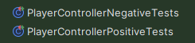

### <a id="run">Run tests</a>
#### To run all the tests, open the test suite XML file located at test-suite/player-controller-tests.xml and click 'Run'

  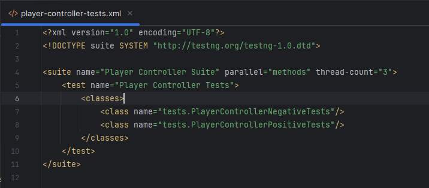

  

### <a id="threads">Manage thread counts</a>
#### The thread-count in the player-controller-tests.xml defines the number of parallel test threads to run

### <a id="allure">Create Allure report</a>
#### After running the tests, you can generate the Allure report. Open the Maven tool window, locate allure:serve under the plugins section, and double-click it to view the report in your browser

  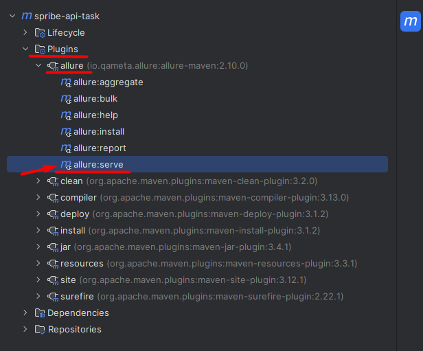

#### New generated report should appear in a new window

  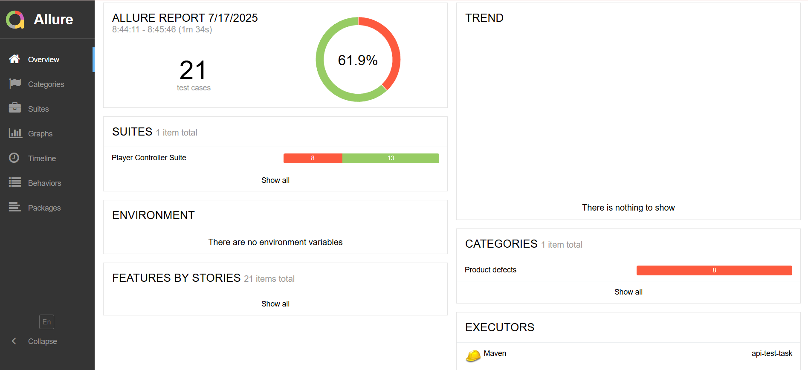

# <a id="results">Tests Results</a>

#### There are failed tests because of bugs

## <a id="positive_fails">Positive tests failures</a>

### Test #1: Verify that a new player is created successfully by role 'supervisor'

#### According to a requirement "Only those with role ‘supervisor’ or ‘admin’ can create users" we expect that user with role 'supervisor' should be able to create new users.
#### Creating a new user by the role 'supervisor' returns the correct status code, and a player is successfully created. However, the test fails because the response contains incorrect data. We expect to see same fields as from request
#### Password, age, role, screenName, gender are not correct in the response body

  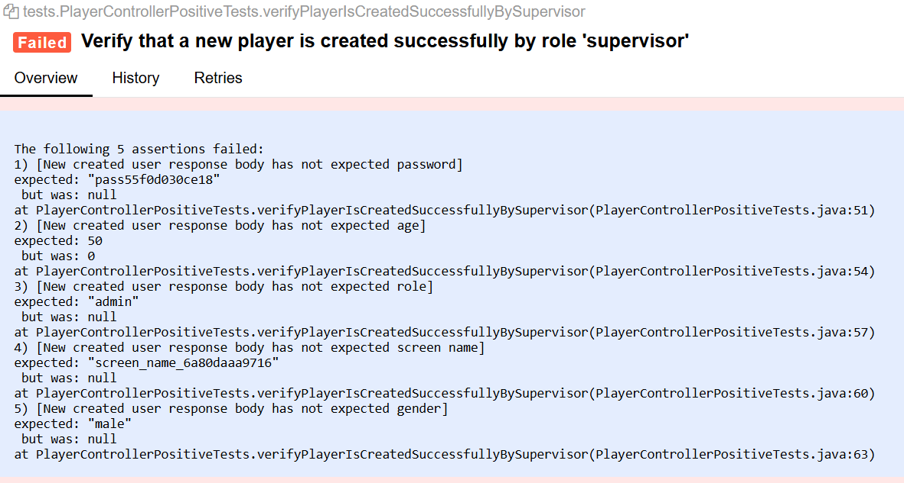

### Test #2: Verify that a new player is created successfully without 'password'
#### As a field 'password' is optional we expect that a user with empty password should be created. 
#### Creating such user returns the correct status code, and a player is successfully created. However, the test fails because the response contains incorrect data. We expect to see same fields as from request

  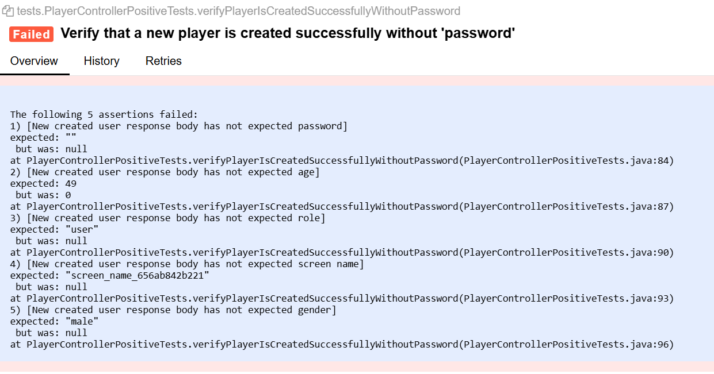

### Test #3: Verify that a new player is created successfully by role 'admin'
#### According to a requirement "Only those with role ‘supervisor’ or ‘admin’ can create users" we expect that user with role 'admin' should be able to create new users. But actually it returns incorrect status code and a new user is not created

  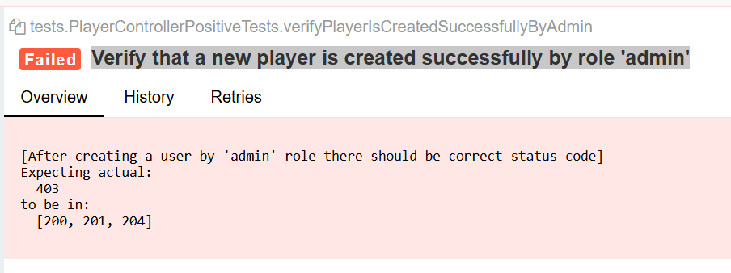

## <a id="negative_fails">Negative tests failures</a>
### Test #1: Verify that player creation fails when the provided password is more than 15 symbols
#### According to a requirement "‘password’ must contain latin letters and numbers (min 7 max 15 characters)" we expect that user with password longer than 15 symbols should not be created, but actually it is created

  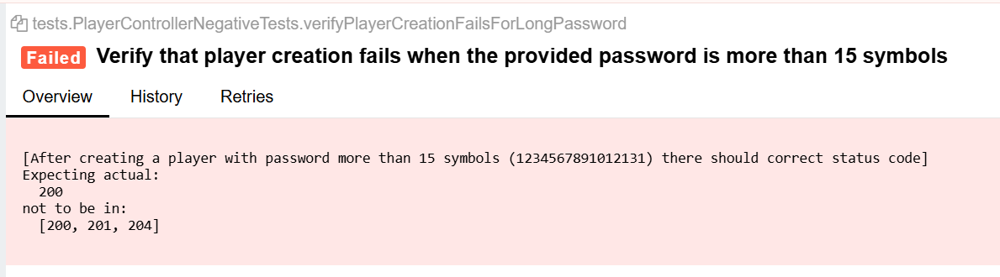

  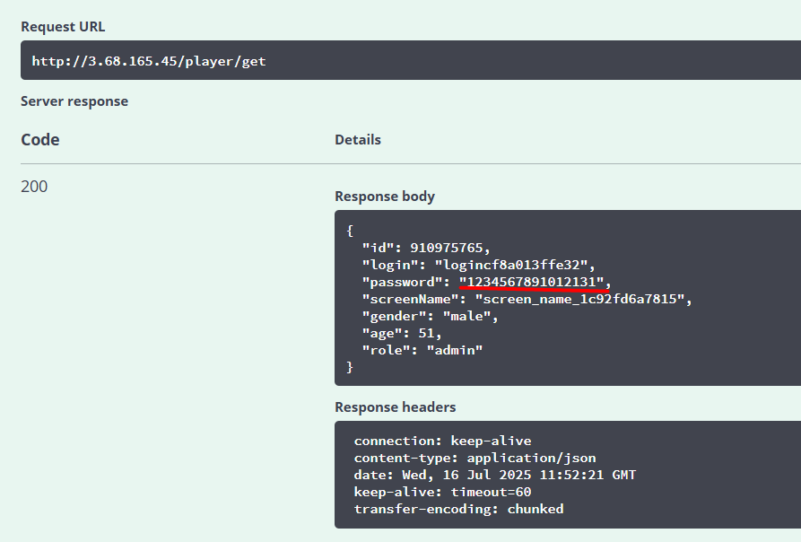

### Test #2: Verify that player creation fails when the provided password is less than 7 symbols
#### According to a requirement "‘password’ must contain latin letters and numbers (min 7 max 15 characters)" we expect that user with password shorter than 7 symbols should not be created, but actually it is created

  

  

### Test #3: Verify that player creation fails when the provided password contains special symbols
#### According to a requirement "‘password’ must contain latin letters and numbers (min 7 max 15 characters)" we expect that user with special symbols password  should not be created, but actually it is created

  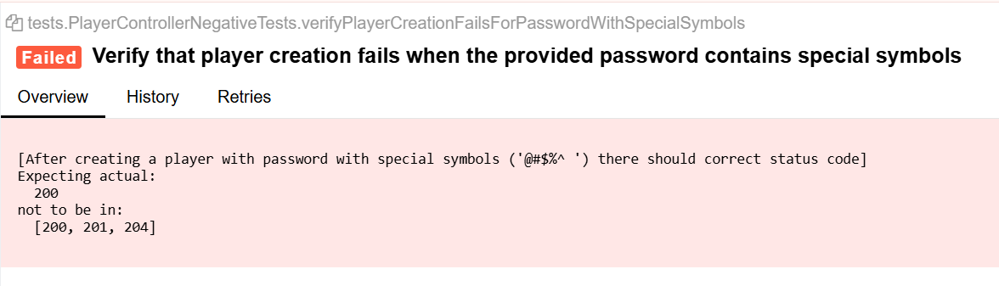

  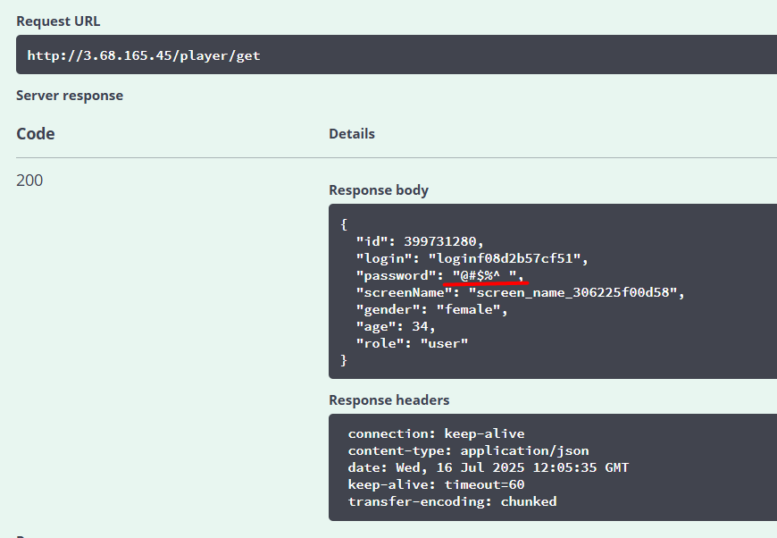

### Test #4: Verify that player creation fails when the provided gender is invalid
#### According to a requirement "User`s ‘gender’ can only be: ‘male’ or ‘female’" we expect that user with invalid gender should not be created, but actually it is created

  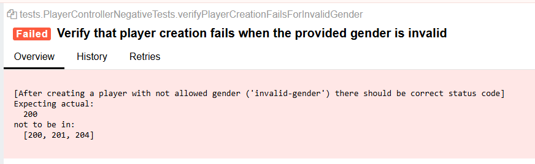

  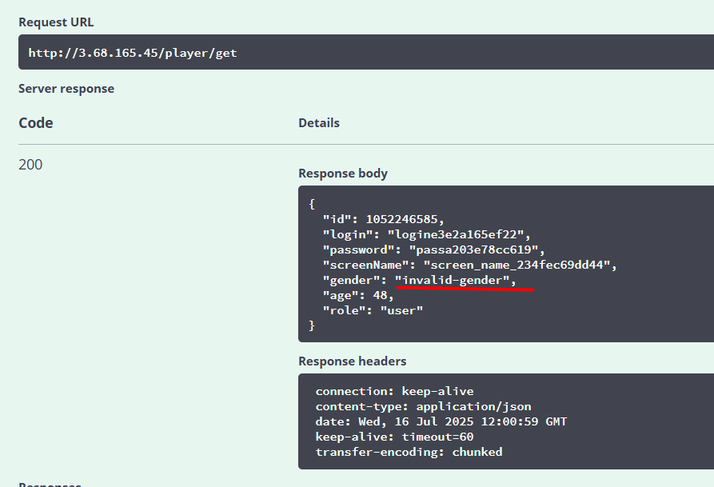

### Test #5: Verify that a role 'user' should not be able to delete itself
#### According to a requirement "'user' can perform any operation on its user except delete" we expect that user with role 'user' should not be able to delete its own user, but actually it does

  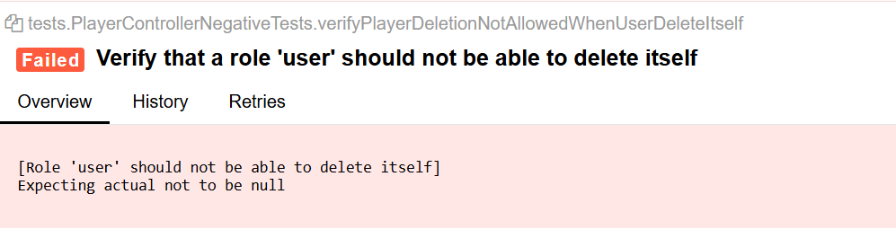

## Test Environment

- [x] Programming Language: `Java`
- [x] Automation Libraries: `Rest Assured`
- [x] Reporting Tool: `Allure` (for test results and reports)
- [x] Version Control: `Git`
- [x] Repository: `GitHub` ()

# <a id="technology">Tools and technologies</a>

  <code></code>
  <code></code>
  <code></code>
  <code></code>
  <code></code>
  <code></code>
  <code></code>

