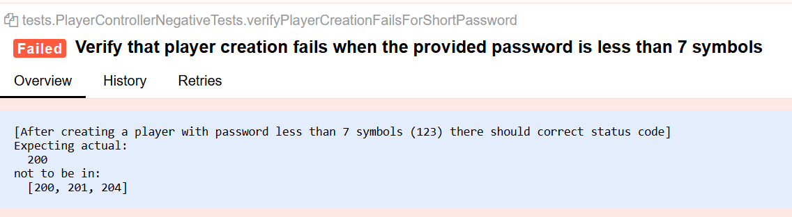

# Test automation project for [Player Controller](http://3.68.165.45/swagger-ui.html#/player-controller)

# <a name="contents">Contents</a>

+ [Getting Started](#start)
+ [Test Results](#results)
+ [Tools and technologies](#technology)

# <a name="start">Getting Started</a>

### Tests structure

There are two tests classes for the player controller: positive tests and negative tests

  

### Run tests
To run all the tests, go to test suite xml by the path test-suite/player-controller-tests.xml and click run

  

  

### Manage thread counts
The Thread-count in the player-controller-tests.xml defines the number of parallel test threads to run

### Create Allure report
After running the tests, you can generate the Allure report. Open the Maven tool window, locate allure:serve under the plugins section, and double-click it to view the report in your browser

  

New generated report should appear in a new window

  

# <a name="results">Tests Results</a>

There are couple failed tests because of bugs

## Positive tests failures

### Test #1: Verify that a new player is created successfully by role 'supervisor'

With role 'supervisor' it returns correct status code and new player is actually created. It fails because of incorrect data returns after user is created. We expect to see same field as from request
Password, age, role, screenName, gender are not correct in the response body

  

### Test #2: Verify that a new player is created successfully by role 'admin'
According to a requirement "Only those with role ‘supervisor’ or ‘admin’ can create users" we expect that user with role 'admin' should be able to create new users. But actually it returns incorrect status code and a new user is not created

  

## Negative tests failures
### Test #1: Verify that player creation fails when the provided password is more than 15 symbols
According to a requirement "‘password’ must contain latin letters and numbers (min 7 max 15 characters)" we expect that user with password longer than 15 symbols should not be created, but actually it is created

  

  

### Test #2: Verify that player creation fails when the provided password is less than 7 symbols
According to a requirement "‘password’ must contain latin letters and numbers (min 7 max 15 characters)" we expect that user with password shorter than 7 symbols should not be created, but actually it is created

  

  

### Test #3: Verify that player creation fails when the provided password contains special symbols
According to a requirement "‘password’ must contain latin letters and numbers (min 7 max 15 characters)" we expect that user with special symbols password  should not be created, but actually it is created

  

  

### Test #4: Verify that player creation fails when the provided gender is invalid
According to a requirement "User`s ‘gender’ can only be: ‘male’ or ‘female’" we expect that user with invalid gender should not be created, but actually it is created

  

  

### Test #5: Verify that a role 'user' should not be able to delete its user
According to a requirement "'user' can perform any operation on its user except delete" we expect that user with role 'user' should not be able to delete its own user, but actually it does

  

## Test Environment

- [x] Programming Language: `Java`
- [x] Automation Libraries: `Rest Assured`
- [x] Reporting Tool: `Allure` (for test results and reports)
- [x] Version Control: `Git`
- [x] Repository: `GitHub` ()

# <a name="technology">Tools and technologies</a>

  <code></code>
  <code></code>
  <code></code>
  <code></code>
  <code></code>
  <code></code>
  <code></code>

